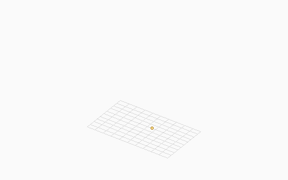

# pyslicer

pyslicer turns a 3D model file (STL) into printer instructions (G-code) for a filament 3D printer.

It reads the model, cuts it into thin layers, draws the outer walls and fill pattern, then writes a G-code file your printer can run.



## Requirements

- Python 3.10 or newer
- A working pip install

## Install

From the project folder:

```bash
pip install -e ".[dev]"
```

That installs pyslicer and the tools used to run tests.

## Use it

```bash
python -m pyslicer model.stl output.gcode
```

Or, after install:

```bash
pyslicer model.stl output.gcode
```

Replace `model.stl` with your model path and `output.gcode` with where you want the G-code saved.

### Common options

| Option | What it does | Default |
|--------|----------------|---------|
| `-l` / `--layer-height` | Thickness of each layer, in mm | `0.1` |
| `-n` / `--num-perimeters` | How many outer wall loops to print | `3` |
| `-d` / `--filament-diameter` | Filament width, in mm | `1.75` |
| `-o` / `--perimeter_overlap_percent` | How much wall loops overlap (smaller means more overlap) | `1.0` |
| `-p` / `--perimeters_only` | Walls only; skip fill | off |
| `-a` / `--append_perimeters` | Also keep the original outline from the STL | off |
| `-v` / `--verbose` | Print more detail while running | off |

Example with a thicker layer and two walls:

```bash
pyslicer model.stl output.gcode -l 0.2 -n 2
```

## Preview G-code in a browser

After you have a `.gcode` file:

```bash
python -m pyslicer.preview output.gcode preview.html
```

Or while slicing, write both at once:

```bash
pyslicer model.stl output.gcode --html-preview preview.html
```

Open the HTML file in any browser. You get a rotatable 3D view of the toolpaths
(drag to spin, scroll to zoom), per-layer 2D drawings, and the full G-code listing.

## Demo: slice #3DBenchy and open the viewer

Downloads the CC0 [#3DBenchy](https://www.3dbenchy.com/) model (if needed),
slices it, writes an HTML preview, and opens it in your default browser
(macOS, Windows, and Linux):

```bash
python -m pyslicer.demo
```

Or, after install:

```bash
pyslicer-demo
```

Useful flags: `--no-open`, `--force-download`, `-l 0.4`, `-n 2`,
`--write-readme-gif` (writes `docs/benchy_demo.gif` at 2×; needs Pillow).

In the HTML viewer you can **Record movie** (WebM) or **Export GIF** of the simulation.

## Tests

```bash
pytest
```

To also check that most of the code is covered by tests:

```bash
pytest --cov=pyslicer
```


## Project layout

- `src/pyslicer/` — the slicer code (geometry, slicing, fill, G-code)
- `tests/` — unit tests, including checks that G-code numbers and commands are correct
- `pyproject.toml` — package and dependency settings

## License

MIT. See [LICENSE](LICENSE).
